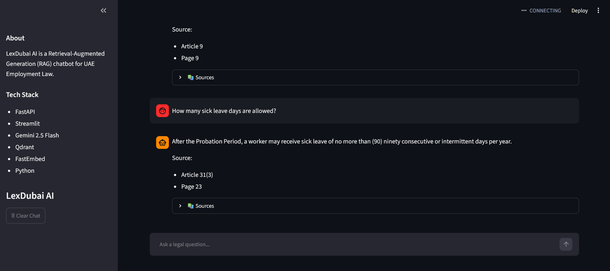
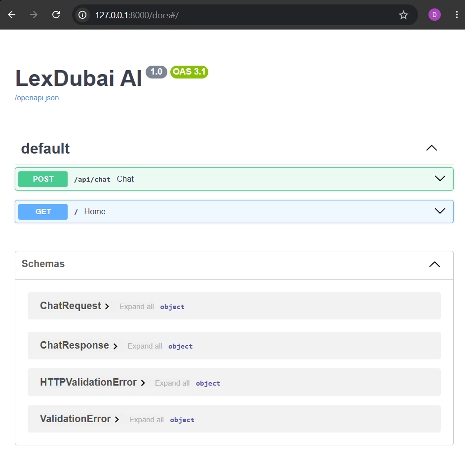

# ⚖️ LexDubai-AI

An AI-powered Retrieval-Augmented Generation (RAG) chatbot that answers questions about **UAE Employment Law** using hybrid retrieval (Vector Search + BM25) and Google Gemini.

---

## 🚀 Features

- 📄 PDF ingestion and preprocessing
- ✂️ Article-based document chunking
- 🔍 Hybrid Retrieval (Vector Search + BM25)
- 🧠 Google Gemini 2.5 Flash for answer generation
- 🗄️ Qdrant Vector Database
- ⚡ FastAPI REST API
- 💻 Streamlit Chat Interface
- 📚 Source article citations with page numbers

---

# Demo

## Streamlit Chat Interface



---

## FastAPI Documentation



---

## System Architecture

```text
                  UAE Employment Law PDF
                           │
                           ▼
                 PDF Processing & Cleaning
                           │
                           ▼
                  Article-based Chunking
                           │
                           ▼
                 FastEmbed Embeddings
                           │
                           ▼
                 Qdrant Vector Database
                           │
        ┌──────────────────┴──────────────────┐
        │                                     │
 Vector Retrieval                      BM25 Retrieval
        │                                     │
        └────────────── Hybrid Retrieval ─────┘
                           │
                           ▼
                  Google Gemini 2.5 Flash
                           │
                           ▼
                    FastAPI Backend
                           │
                           ▼
                   Streamlit Chat UI
```

---

# Tech Stack

| Technology | Purpose |
|------------|---------|
| Python | Backend |
| FastAPI | REST API |
| Streamlit | User Interface |
| Google Gemini 2.5 Flash | LLM |
| Qdrant | Vector Database |
| FastEmbed | Embeddings |
| BM25 | Keyword Retrieval |
| Hybrid Search | Improved Retrieval |

---

# Project Structure

```
LexDubai-AI
│
├── app/
│   ├── api/
│   ├── config/
│   ├── ingestion/
│   ├── llm/
│   ├── retrieval/
│   ├── utils/
│   └── main.py
│
├── data/
├── docs/
├── tests/
├── streamlit_app.py
├── requirements.txt
├── README.md
└── .env.example
```

---

# Installation

Clone the repository

```bash
git clone https://github.com/DeepakSharma34/LexDubai-AI.git

cd LexDubai-AI
```

Create virtual environment

```bash
python -m venv .venv
```

Activate

Windows

```bash
.venv\Scripts\activate
```

Install dependencies

```bash
pip install -r requirements.txt
```

---

# Environment Variables

Create a `.env` file

```env
GOOGLE_API_KEY=YOUR_API_KEY

QDRANT_PATH=vector_db

COLLECTION_NAME=uae_employment

EMBEDDING_MODEL=BAAI/bge-small-en-v1.5

TOP_K=5

LLM_MODEL=gemini-2.5-flash
```

---

# Build the Knowledge Base

```bash
python -m app.ingestion.ingest

python -m app.retrieval.index_documents
```

---

# Run FastAPI

```bash
uvicorn app.main:app --reload
```

Swagger UI

```
http://127.0.0.1:8000/docs
```

---

# Run Streamlit

```bash
streamlit run streamlit_app.py
```

---

# Example Questions

- What is the probation period?
- How many annual leave days are employees entitled to?
- How many sick leave days are allowed?
- What are the maximum working hours?
- Can an employer terminate an employee during probation?
- What are maternity leave provisions?

---

# Future Improvements

- Conversation memory
- Multi-document support
- Cross-document retrieval
- Reranking model
- Docker deployment
- Authentication

---

# Author

**Deepak Sharma**

LinkedIn: https://www.linkedin.com/in/deepak989
